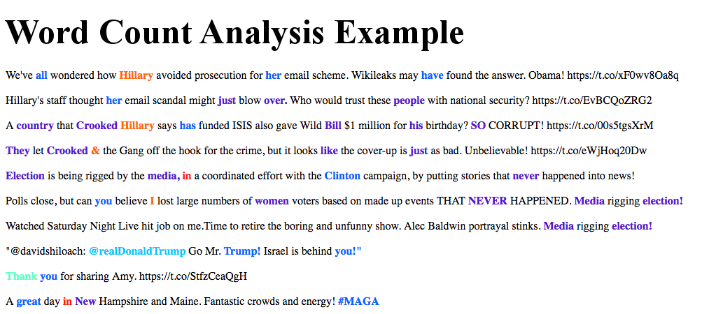
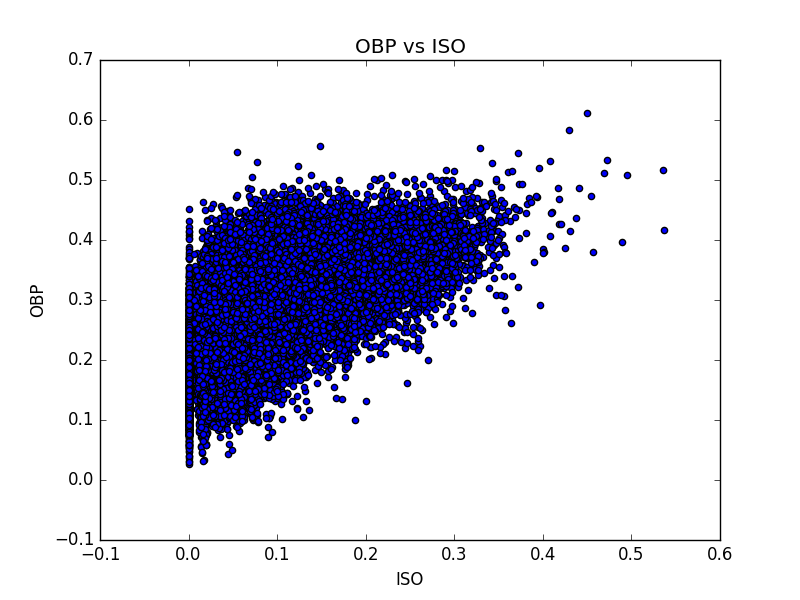
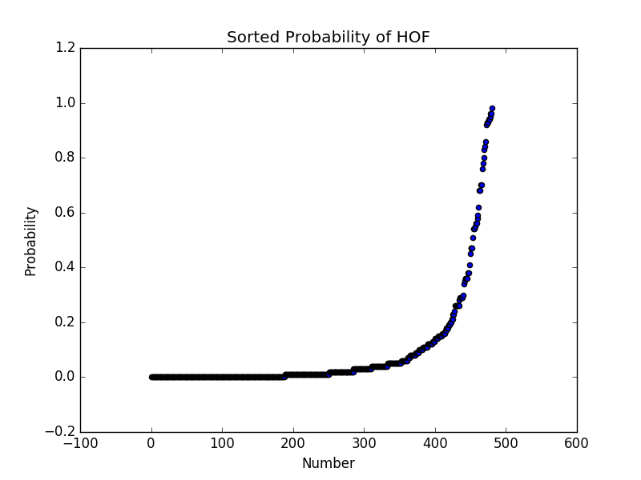
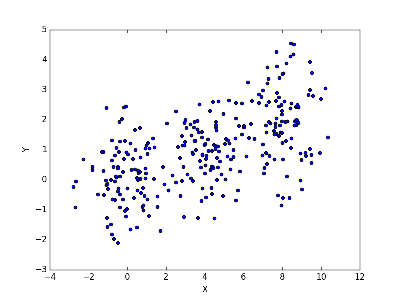
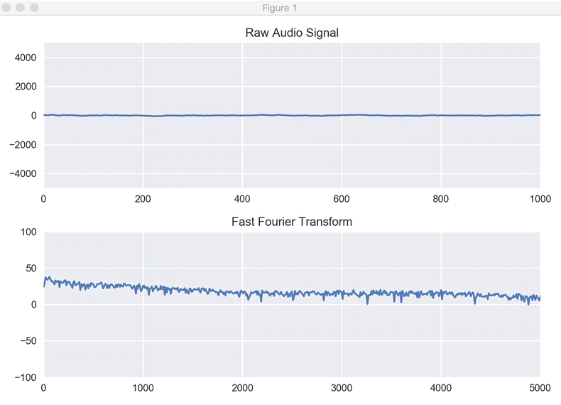

# Learning Python

These will be my forays into learning Python for data science. I'll track my
projects here with a quick note on what each project does.

## Twitter Counter

This code connects to the Twitter API and searches for tweets based on a
keyword provided by the user. It then gets the text of the tweets and counts
all the words (filtering the most common words like "of" or "the") and prints
a word count for the N most common words in tweets that match the search.
There is also an example of using the Twitter API to look up a users stream
and then search through their tweets to get their most commonly used words.

## TOAES Webscrape/Highlight Words

This code loads a webpage and accesses the paragraph tags or finds the text of the book and then deconstructs that into a series of words
and once again counts the occurences of each word. This was designed to reuse
much of the idea from the Twitter Counter, but apply it to data picked out of
a webpage using the BeautifulSoup Library. It also applies the common word
filter. A major improvement this time was to modularize most of the code so it
can be imported. wordCountMaker.py contains all of the code for making the
html, the image, and manipulating the dictionaries built out of the words.
This can be imported and then the user only needs to provide the text from the
beautiful soup library to the dictionary; since this must be done on a page by
page basis.

The Highlight Words addition takes these word counts and creates a dictionary
from the words found (technically two: one with formatting removed and one
with formatting in tact). It then calculates for each word that number of
times it appears relative to the most common word and assigns a color based on
this frequency compared to the sample's mode. It then creates an HTML file
where each word is colored and placed back in order; the colors are currently
in bins of 10%. So if a word is in the top 10% most common words, it will be
red. If it's in the 10-20% most common words, it will be orange. And so on,
until we get to the words that appear with very little frequency, which are
left as black and unbolded, so that there is a contrast. All words that are in the top 
80% most common words are bolded. This macro also makes a plot of the N most common words 
(N is set in the plot making function as "limit"). This also makes a plot of the words and their counts and places it in the HTML page. The most common words in the King James Version of the Bible available in project Guttenburg are shown below. Following that is an example image counting the most common words in a random sample of 200 tweets from Donald Trump's Twitter account, which reused much of the TwitterCounter API access to allow access to the tweet-stream. Also shown is a sample of the generated HTML page is shown below that in image form, with the common words highlighted in their color.

## MLB Database Analyzer

Full writeup here:
https://redlegnation.com/2017/01/17/will-joey-votto-make-the-hall-of-fame-2/

This code loads in a CSV from http://www.seanlahman.com/baseball-archive/statistics/ that contains stats from all years of the MLB. The code makes nested dictionaries for each player by the year of their stats. So for Jim Bob, there is one dictionary made of sub-dictionaries for each year of stats. So stats['jimbob'][2009] would return a dictionary of Jim Bob's stats from 2009. The code also santizes the inputs, replacing all missing data with -999 so these missing values can be easily checked and removed from future analyses. There are functions to draw the correlations between all possible statistical variable combinations, to compute the career average of a players stats, to remove pitchers from the main batting dictionary, to add whether or not a player has been added to the hall of fame, and to add a players personal information (name, date of birth, etc) to the dictionary so that the dictionary can be fully filtered into "only those players who would be inducted into the hall of fame as a position player (not a pitcher)" and then a machine learning algorithm can be applied to predict if a player will be inducted to the hall of fame (and the personal information can be used to associate the players name with the prediction). This is all done without PANDAS (python library) so that I can truly learn my way around python data structures. PANDAS will be attempted in another project.

Some example plots 

* 1: correlations between OBP and ISO, each dot represents
one season for one player 

* 2: The probability of being inducted into the hall of fame, as calculated by
a Random Forest Classification Algorithm. This shows the discriminatory power
of the algorithm. A threshold is computed by optimizing the F1 Score (a
measure of how accurate the algorithm was) on the test data using the output
probabilities. 

In it's first iteration, the algorithm predicts the following for players that
are still player or have retired after the year 2005 (using a probability
threshold and then 1/2 the threshold for "maybe"), assuming that they never
play another inning (there is no averaging of stats to account for "rate of
accrual"):

Predicted HOF:
['Todd Helton', 'Barry Bonds', 'Omar Vizquel', 'Johnny Damon', 'Sammy Sosa',
'David Ortiz', 'Gary Sheffield', 'Adrian Beltre', 'Alex Rodriguez', 'Manny
Ramirez', 'Ken Griffey', 'Albert Pujols', 'Vladimir Guerrero', 'Bobby Abreu',
'Jeff Bagwell', 'Craig Biggio', 'Jim Thome', 'Frank Thomas', 'Miguel Cabrera',
'Bernie Williams', 'Carlos Beltran', 'Rafael Palmeiro', 'Derek Jeter',
'Chipper Jones', 'Ichiro Suzuki']

Maybe HOF:
['Carlos Delgado', 'Ivan Rodriguez', 'Moises Alou', 'Julio Franco', 'Larry
Walker', 'Jason Giambi', 'Paul Konerko', 'Jeff Kent', 'Kenny Lofton', 'Edgar
Renteria', 'Aramis Ramirez', 'Steve Finley', 'Magglio Ordonez', 'Miguel
Tejada', 'Torii Hunter', 'Jimmy Rollins', 'Luis Gonzalez']

## Pygame Test

This is simply an attempt to make a small interactive session with a few
classes and interaction from the user. There is no "game" really... the user
can spawn a set of ever changing circular objects that move around within a
space. There is a counter that computes the score for each object
(lifetime). This is based on the pygame module that is freely available
online. No more work is planned for this, it was a simple chance to explore
the pygame library, work on infinite loops with user input, and to build a few
classes and class managers.

## Animation Test

This was a test of using MatPlotLib's built in animation functionality. I
found many online examples of how to draw a Sine wave or similar, but I wanted
to be able to draw a scatter plot that updates each time a new point is
generated. I plan to extend this into making points appear on a map in my next
example. Sample output below, plotting a 2D normal distribution sampling:

## Chicago Crimes

This is being used for two reasons: 1) to learn Pandas in detail, 2) To see if
I can make predictions on where crimes will be. The first step is to read in
all crime data from 2016, then organize it by neighborhood and then split out
the dataframes into individual neighborhood dataframes for small scale
analysis. After that, I will work on manipulating the full data set.

## Facial Recognition & Handwriting Recognition

Both of these are codes found on the internet to familiarize myself with image
reconignition. My goal is to start with these as examples and extend to more
complex, self-written image recognition software.

## Simple K-Means

An implementation of a standard k-means clustering algorithm on 2D data. Made
to produce sample plots for teaching about k-Means. Sample outputs below: 1)
shows the steps of finding the clusters 2) shows a method for selecting the
number of clusters to use by showing the final results for 1-9 clusters and
then computing the mean distance between points and their cluster center. The
kink can be used to determine the optimal number of clusters.

## Image Flattener

This builds on the K-Means example above, by breaking an image into it's color
components and projection all points into a 3D Red, Green, Blue space. A
K-Means clustering is applied and all members of the cluster are forced to be
the mean value of the cluster. Then the image is reproduced with the new color
scheme. The image manipulation is built on Python's PILLOW library.

## Chicago Crime Map

This was build as a foray into using GIS (Geographic Information Systems) data
alongside a general interest in how crime changes per neighborhood in Chicago.
Outputs are heat maps of crimes in 2016 Chicago database. Violent crimes are
defined as homicide, assault, battery, and criminal sexual assault (the
Chicago PD produces these labels). 

## Streaming Audio

To get some practice interfacing hardware with Python, I wrote a program that
plots the current inputs into the microphone. It grabs control of the
microphone, samples the input repeatedly, and draws the raw input and a
Fourier transform of the data. 

